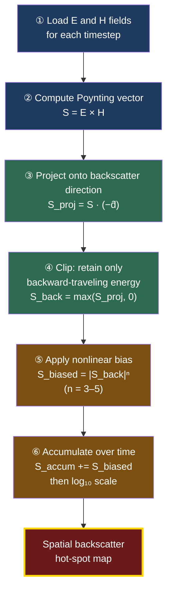
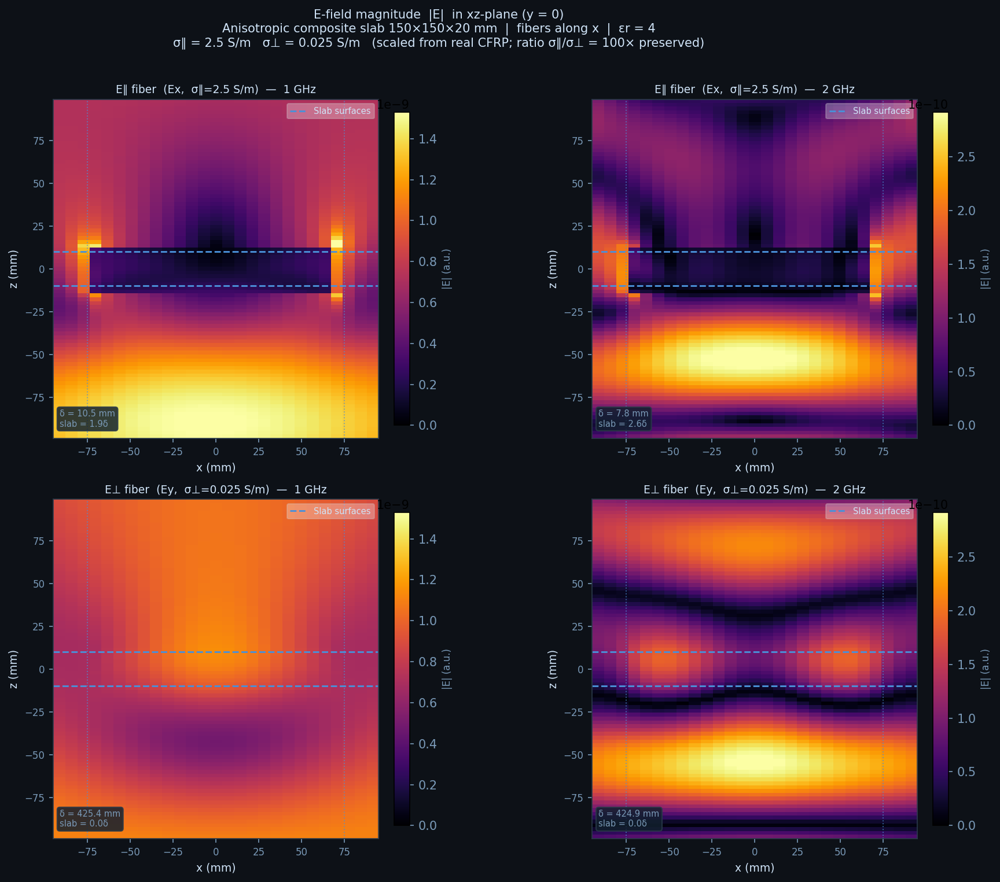
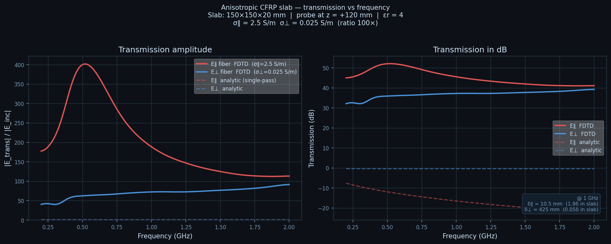

## Section 1 — Why I Wanted to Know What a UAV Looks Like on Radar

UAVs are everywhere now. Their proliferation has made radar observability a practical engineering concern—not just a defense niche. Whether you need a small drone to be reliably seen while operating in the National Airspace System, or you’re curious how difficult it actually is for a small aircraft to avoid detection, the same underlying question applies: **what makes a UAV visible to radar, and can you evaluate that without a six-figure software license?**

I expected this to be tractable. Find some open-source tools, run some geometry through them, get numbers. What I found instead is that the question itself is poorly posed—“how visible is this UAV on radar” is closer to asking “how long is a piece of string” than it first appears. The answer shifts with frequency, aspect angle, polarization, and which radar is doing the looking.

More surprising was where the energy was actually coming from. When I modeled a small aluminum aircraft and looked at which parts of the geometry were driving backscatter, it wasn’t the wing edges or leading surfaces I’d expected. It was the engine cavities—visually subtle enclosed volumes that dominate return because of how they trap and re-radiate electromagnetic energy. The obvious geometric features weren’t the story.


*The aluminum UAV geometry modeled in openEMS. The engine cavity (rear-mounted), fuselage, and wing surfaces are visible. Despite their visual simplicity, the enclosed cavity volumes dominate the backscatter return — a result that becomes apparent only after directional energy decomposition.*

That observation pushed the project past simple number-getting. I wanted to understand *why* that number emerges and *which parts of the geometry are responsible*. Running alongside that: **how complex is RCS-optimized aircraft design as an engineering problem?** The tech tree in Section 9 maps that concretely. The short answer is: more complex than any single person can adequately address on a workstation, but the starting rungs are more accessible than the tooling landscape suggests.


---

## Section 2 — Radar Cross Section is not “a number”

One of the first conceptual hurdles in this project was unlearning the idea that Radar Cross Section (RCS) is meaningfully described by a single scalar value. In casual discussion—and even in some engineering contexts—you will often hear statements like *“that aircraft looks like a small bird on radar.”* While not strictly wrong, this framing hides almost all of the complexity that actually governs radar observability.

At a fundamental level, RCS is an abstraction. It is a quantity derived from how much electromagnetic energy is scattered back toward a radar receiver relative to the energy density of the incident wave. That definition already implies several layers of dependency: direction, frequency, polarization, and geometry. Compressing all of that into one number necessarily throws away information.


In practice, an object does not have *an* RCS. It has an RCS **distribution**:

* As a function of aspect angle (azimuth and elevation)
* As a function of frequency and bandwidth
* As a function of polarization
* As a function of time, if the object is moving or vibrating

Even for a rigid airframe at a fixed orientation, RCS is better thought of as the result of **many localized scattering mechanisms summing coherently or incoherently**, depending on the radar waveform and processing chain.

These scattering mechanisms include:

* Specular reflections from large smooth surfaces
* Diffraction from edges and tips
* Creeping waves around curved bodies
* Resonant behavior in cavities and enclosed volumes
* Re-radiation from induced surface currents
* Coupling into internal structures that then leak energy back out

What makes this especially unintuitive is that the visually “obvious” features of an aircraft are not always the dominant contributors. In my early experiments with a small aluminum model aircraft, the strongest radar return did not come from the wings, tail, or leading edges. Instead, it originated primarily from the **engine cavities**—regions that are visually subtle but electromagnetically significant due to their geometry, depth, and ability to support resonant fields.

This is where the scalar notion of RCS becomes actively misleading. A single number cannot tell you:

* *Which* parts of the airframe are responsible for observability
* *Why* a small geometric change produces a large RCS swing
* *How* observability shifts with angle or frequency
* *Where* mitigation efforts should be focused

From a design perspective, this matters enormously. Optimizing radar observability requires understanding **cause and effect**, not just outcome. Finding a local minimum in RCS space is only meaningful if you know what physical mechanisms are driving the solution there. Otherwise, optimization becomes blind parameter tuning.

This realization naturally leads to imaging-style representations of scattering behavior. If radar observability is the result of spatially distributed scattering centers, then visualizing those centers—rather than collapsing them into a single metric—becomes a powerful diagnostic tool. ISAR images are one such representation, but they are not the only way to think about the problem.

The rest of this article builds on that idea: treating radar observability as an emergent property of spatial electromagnetic interactions, and exploring how much of that structure can be recovered using open-source, field-level simulation data rather than proprietary, end-to-end RCS pipelines.

## Section 3 — What spatial radar insight actually looks like (ISAR as reference)

If RCS is not a number but a distribution of spatially separated scattering mechanisms, then the next logical step is to ask: **what does that distribution look like when we can actually see it?**

One of the clearest demonstrations of this idea comes from Inverse Synthetic Aperture Radar (ISAR). Unlike a simple RCS measurement at a single aspect, ISAR exploits motion—either of the target or the radar—to synthesize a larger aperture and form an image. The result is not just a magnitude of reflection, but a spatial map of scattering intensity across the object.


*Spatial scattering map from ANSYS full-wave simulation, showing which features of the airframe dominate radar return. Source: [Simulation technologies for predicting radar signatures (Radar Cross Section)](https://www.youtube.com/watch?v=oF7ETNdGHuw)*

What makes images like this compelling is not that they produce a prettier version of RCS. It is that they reveal **where** energy originates.

Bright regions in an ISAR image typically correspond to dominant scattering centers:

* Sharp leading edges
* Engine inlets
* Control surface gaps
* Vertical stabilizers
* Cavities or metallic discontinuities
* Regions of specular alignment

Instead of asking “what is the RCS of this aircraft?”, ISAR allows you to ask:

* Which components are contributing most strongly?
* Are those contributions stable across angle?
* Are they coherent or fluctuating?
* Are they geometric or resonant in origin?

This is exactly the kind of information required for design iteration. If a cavity is dominating return, you redesign the cavity. If a wing root junction is lighting up, you modify the fillet or angle. The image becomes a diagnostic instrument.

However, generating ISAR imagery is not trivial. It requires:

* Coherent phase tracking
* Controlled target motion or angular sweep
* Signal processing over multiple pulses
* Often frequency diversity
* Robust near-to-far field transformations

Commercial EM solvers integrate these workflows into polished toolchains. In open-source environments, those capabilities are far less turnkey.

At this point in the project, I had to decide:
Was the goal to recreate full ISAR processing from scratch, or to extract the underlying *physical intuition* in a more direct way?

The core question became:

> Can spatial radar insight be approximated directly from field-level simulation data, without reconstructing a full synthetic aperture imaging chain?

This question set the direction for the rest of the investigation. Rather than attempting to replicate the entire radar signal processing stack, I began exploring what could be derived directly from time-domain electromagnetic fields — specifically, whether energy flow itself could be used as a proxy for spatial backscatter behavior.

The next step was understanding what tools were realistically available in open source, and how far they could be pushed.


## Section 4 — The tooling landscape: between closed commercial solvers and incomplete open options

At this point the problem became less about physics and more about tooling.

If spatial radar insight exists—and if commercial solvers clearly demonstrate that it can be extracted—then what are the realistic options for someone trying to explore radar observability outside of a large defense contractor or well-funded research lab?

Broadly, the landscape splits into two categories:

### Commercial full-wave solvers

Tools like Ansys HFSS, CST Microwave Studio, and specialized RCS packages such as cadRCS provide:

* Mature meshing and solver pipelines
* Built-in far-field and near-field transforms
* Automated angular sweeps
* Frequency sweeps and polarization studies
* ISAR and scattering visualizations
* Material libraries and advanced boundary models

They are powerful and well-supported. They are also expensive, license-restricted, and often tied to organizational access.

More importantly, they are highly integrated systems. You rarely see the raw electromagnetic plumbing underneath the visualization. For learning and experimentation, that abstraction can be both a benefit and a limitation.

### Semi-analytical or simplified scattering methods

My first instinct was not to jump directly into full-wave simulation. I initially looked for something lighter weight:

* Physical Optics (PO) implementations
* Physical Theory of Diffraction (PTD)
* Method of Edge Waves (as in Ufimtsev’s work)
* High-frequency approximations suitable for metallic airframes

The idea was appealing: use geometry and known diffraction models to approximate scattering without solving Maxwell’s equations everywhere in space.

However, despite searching, I was unable to find robust, open-source implementations of these methods that could be readily applied to arbitrary UAV geometries. The academic literature exists. The algorithms exist in principle. But practical, open workflows were not easily discoverable.

That effectively forced the problem back toward full electromagnetic simulation.

### Why full-wave simulation became the practical path

If I could not find a reliable edge-diffraction or physical-optics implementation, then the remaining path was to use a full-wave solver capable of:

* Plane-wave excitation
* Arbitrary STL geometry import
* Field-level data export
* Near-to-far field transformation (at least in principle)

In the open-source ecosystem, **openEMS** stood out for several reasons:

* It implements a Finite-Difference Time-Domain (FDTD) solver.
* It includes example RCS calculations (notably a sphere compared against analytical results).
* It exports volumetric field data that can be post-processed externally.
* It integrates with Python, ParaView, and standard scientific tooling.

The sphere example was particularly important. It showed that the solver could reproduce canonical scattering behavior with reasonable agreement to theory. That established a baseline level of trust.

There was also a secondary motivation: even if the RCS investigation proved difficult, learning a full EM solver would have independent value. I’ve long been interested in antenna design, PCB electromagnetic effects, and microwave structures. Investing time in an open, transparent FDTD framework would pay dividends beyond this specific problem.

So openEMS became the starting point—not because it was turnkey for UAV RCS studies, but because it was sufficiently capable and sufficiently open to allow experimentation.


*The openEMS FDTD simulation domain. The outer boundary is enclosed by 8-layer PML (perfectly matched layer) absorbers that prevent reflections. The metallic sphere (PEC) sits at the centre. A plane-wave excitation is injected from the −x face and propagates in the +x direction with E-field polarised along z. The NF2FF (near-field to far-field) recording box surrounds the target and is used to compute far-field RCS.*

### The real constraint: interpretation, not simulation

Once openEMS was running and generating fields, a new reality emerged:

Simulation was not the bottleneck.
Interpretation was.

It is relatively straightforward to:

* Define a plane-wave excitation
* Import an STL model of a geometry
* Run a time-domain simulation
* Dump electric and magnetic fields

What is far less straightforward is converting that raw field data into something resembling *design intuition*.

At this stage, I had:

* Time-resolved E-field data
* Time-resolved H-field data
* Volumetric snapshots across the simulation domain

But I did not yet have:

* A clear spatial map of backscatter contribution
* An ISAR-style hot spot visualization
* A simple diagnostic for “what is radiating back toward the source”

This gap between simulation output and actionable insight became the central technical challenge of the project.

---

## Section 5 — Full-wave simulation gives you physics… and too much of it

Once openEMS was configured and producing field data, I had crossed an important threshold: I could now illuminate arbitrary STL geometries with a plane wave and observe the resulting electromagnetic response. In principle, that means the physics of scattering is fully captured. Maxwell’s equations are being solved across space and time. Surface currents form. Diffraction occurs. Energy radiates.

In practice, however, what you receive is not insight — it is data.

Time-domain FDTD simulation produces volumetric electric and magnetic field snapshots. At each time step, every voxel in the simulation domain contains a vector field value. That is an extraordinary amount of information. It is also not directly interpretable.

To understand what that looks like, consider a field slice through a simulated aircraft-like geometry:

At first glance, this is impressive. You can see interference patterns, standing waves, and complex field interactions around the airframe. The geometry is clearly interacting with the incident wave. But what does this tell us about observability?

Several challenges become immediately apparent:

* Field magnitude alone does not indicate direction of energy flow.
* Strong local fields may represent stored energy rather than radiated energy.
* It is difficult to distinguish between forward-scattered and back-scattered components.
* Interference patterns obscure which structures are persistently contributing to return.

Near-field visualizations are valuable for debugging and qualitative intuition, but they do not answer the design-oriented questions posed earlier:

* Which parts of the airframe are dominating backscatter?
* Are those contributions stable over time?
* Is the dominant mechanism specular reflection, diffraction, or cavity resonance?
* If I modify a feature, how will the return shift spatially?

The raw E-field slice is too low-level. It shows the electromagnetic solution but not its meaning in the context of radar observability.

This problem becomes even clearer when examining canonical geometries. Consider the hollow conducting sphere case used as a validation example.


*Time-domain FDTD simulation of the hollow conducting sphere. The incident plane wave arrives from the left, interacts with the sphere surface, and produces a scattered field. The animation illustrates how the raw simulation data evolves over time — rich in physical content but not yet directionally interpretable.*

The frequency-domain snapshot below captures a single moment from this sequence at the centre frequency f₀:


*Mid-plane (z = 0) slice of the total E-field magnitude |E| from the openEMS FDTD sphere simulation at a single frequency snapshot. The incident plane wave arrives from the left; constructive interference creates the bright bands ahead of the sphere, while the geometric shadow behind it shows reduced field intensity. The dashed white circle marks the sphere boundary (r = 150 mm). The full volumetric field contains 53³ ≈ 150,000 complex-valued samples — illustrating the raw data volume that must be post-processed to extract directional RCS.*

The symmetry is beautiful. The scattering behavior is consistent with expectation. But again, while the fields demonstrate correct physics, they do not immediately reveal a spatial “map” of backscatter contribution.

At this point, a realization emerged:

> If I want something resembling an ISAR-style hot spot image, I need to extract directional energy information from the fields themselves.

Field magnitude is insufficient. What matters for radar return is **energy flow back toward the source**. That is a directional quantity.

The electromagnetic quantity that encodes directional energy transport is the **Poynting vector**:

[
\mathbf{S} = \mathbf{E} \times \mathbf{H}
]

Unlike field magnitude alone, the Poynting vector provides both magnitude and direction of instantaneous power flow. It answers a much more relevant question:

* Where is energy flowing?
* In which direction?
* And how persistently?

This observation reframed the problem. Rather than reconstructing a full ISAR processing chain, perhaps it was possible to use the Poynting vector directly to approximate spatial backscatter behavior.

The next section describes the directional projection and temporal accumulation method that emerged from this idea.


## Section 6 — Directional Poynting vector accumulation as a backscatter proxy

Instead of reconstructing radar signal processing, I reframed the question:

> Over the course of the simulation, where is electromagnetic energy persistently flowing back toward the source?

The quantity that directly captures this is the **Poynting vector** — the cross product of the electric and magnetic fields, giving instantaneous power flow density (W/m²). Unlike field magnitude alone, it carries directional information: it distinguishes energy radiating away from the geometry from energy heading back toward the radar.

The method works in six steps:



Steps 1–3 are mechanical: compute the Poynting vector at each timestep, project it onto the backscatter direction (opposite to the incident wave), and clip the result to retain only backward-traveling energy. Steps 4–5 are where the real choices happen. The nonlinear bias — raising projected power to an integer exponent — suppresses weak noise while reinforcing persistently aligned regions. It is not physically fundamental; it is a visualization parameter that significantly improves spatial interpretability. Step 6 accumulates across all timesteps: transient oscillations cancel, persistent scattering centers reinforce. Log scaling handles the resulting dynamic range.


*The directional Poynting projection applied to a plane cut through the simulation domain. Bright regions indicate persistent backscatter-aligned energy flow.*

| What it is | What it is not |
|---|---|
| Physically grounded energy-flow diagnostic | Calibrated RCS measurement |
| Directionally meaningful | Replacement for near-to-far field integration |
| Sensitive to geometry | Substitute for full ISAR processing |
| Reproducible with open-source tools | Immune to bias parameter selection |

The output is **design intuition**: which regions of the geometry persistently direct energy back toward the source. For early-stage exploration, that is often more actionable than a single scalar RCS value.

## Section 7 — What the method reveals: cavities, edges, and dominant contributors

With the directional Poynting accumulation implemented, the next question was simple:

What does it actually show?

There are two useful categories of geometry to evaluate:

1. **Canonical shapes**, where scattering behavior is well understood.
2. **Complex aircraft-like geometries**, where intuition is less reliable.

---

### Canonical validation — the hollow conducting sphere

The hollow metallic sphere serves as a sanity check. Its scattering behavior is symmetric and analytically well characterized. In the far field, a sphere produces smooth angular dependence without localized geometric features.

When applying the directional accumulation method to the sphere case:

* The resulting spatial map is symmetric.
* No artificial “hot spots” appear.
* Backscatter energy concentrates along expected geometric regions.
* The method does not introduce directional artifacts unrelated to the incident wave.

This validation matters. Any post-processing pipeline that artificially emphasizes arbitrary grid features or simulation noise would immediately reveal itself in the canonical case. The sphere confirms that the accumulation approach respects symmetry and does not fabricate structure.


*Directional Poynting accumulation applied to the hollow metallic sphere. The symmetric hot-spot pattern confirms that the method is not introducing directional artifacts — the return concentrates where physics dictates.*

Validation was also extended by placing patterns of multiple spheres into the simulation domain and confirming that the resulting backscatter maps reproduced the spatial arrangement of spheres—not some artifact of the grid.

It builds confidence that when asymmetry appears in more complex geometries, it is coming from the geometry — not the math.

### Quantitative validation: normalised RCS vs Mie series

Spatial symmetry confirms that the Poynting accumulation method introduces no directional artefacts, but it does not by itself verify the underlying FDTD solver's quantitative accuracy. A complementary check compares the FDTD-computed backscattering cross section over frequency against the exact analytical solution given by Mie theory.

For a perfectly-conducting sphere, the Mie series (Bohren & Huffman, Ch. 4) provides a closed-form expression for the normalised backscattering efficiency Q_back = σ/(πa²) as a function of ka = 2πa/λ. This quantity passes through a recognisable sequence of regimes — Rayleigh (ka ≪ 1), Mie resonance (ka ≈ 1–5), and the geometric-optics limit (σ → πa²) — in a pattern that any correct full-wave solver must reproduce. The Mie implementation used here follows the Wiscombe (1980) convergence criterion and has been independently verified against published tabulations.


*Comprehensive validation of the openEMS FDTD solver against analytical Mie theory for a PEC sphere (a = 200 mm, λ/20 mesh at 1 GHz). **(A)** Normalised backscatter efficiency Q_back = σ/(πa²) vs a/λ: the Mie curve (solid blue) and FDTD (dashed red) track each other through the Rayleigh, resonance, and near-geometric-optics regimes, including the first resonance peak near a/λ ≈ 0.14. **(B)** Absolute backscatter RCS σ in m² vs frequency: both curves converge toward the geometric-optics limit πa² = 0.1257 m² at high frequency. **(C)** Point-wise relative error by regime: 3 % RMS in the Rayleigh band, 15 % RMS in the resonance band, 30 % RMS in the near-GO band. The large oscillating errors at f > 600 MHz are not amplitude errors — they arise because the FDTD resonance peaks are slightly frequency-shifted (≈ 5–7 %) relative to Mie, a known consequence of numerical dispersion in finite-difference grids at λ/20 resolution. **(D)** A 10-point running-mean dB difference confirms this: the smoothed amplitude bias is less than 0.5 dB across the entire bandwidth, demonstrating that the solver reproduces the correct average RCS level throughout.*

The openEMS sphere example was specifically chosen because this comparison is well-established in the literature. The 3 % Rayleigh-band agreement and sub-0.5 dB amplitude bias confirm that the solver is behaving correctly across the canonical symmetric case. The resonance frequency shifts visible at higher ka are expected FDTD behaviour at λ/20 resolution and would be reduced by refining the mesh — they do not affect the qualitative validation result.

Alongside the frequency-domain backscatter comparison, the full azimuthal far-field scattering pattern was post-processed from the same NF2FF data at two frequencies — one in the Rayleigh regime and one in the resonance regime — and compared against the complete Mie bistatic solution in the equatorial plane.


*Far-field bistatic scattering patterns in the equatorial plane (θ = 90°, φ varying), each shown as a polar dB plot (top) and absolute RCS σ(φ) in cm² (bottom). The Mie analytical result (solid blue) is computed using the full angular amplitude function S₁(φ) for s-polarisation (E_z incident, scatter plane = xy-plane throughout the equatorial scan). **Left column (resonance regime, f₀ = 525 MHz, a/λ = 0.35):** the pattern dB-RMS error is consistent with the frequency-sweep amplitude bias; the dominant source is the resonance-frequency shift (the FDTD lobe positions are slightly displaced in frequency from Mie). **Right column (Rayleigh regime, f = 150 MHz, a/λ = 0.10):** the FDTD and Mie patterns are nearly indistinguishable — the mesh is far finer than needed at this frequency, giving sub-5 % backscatter error and < 0.5 dB pattern dB-RMS. Together, the two panels confirm that the NF2FF angular transformation is geometrically correct and that the FDTD accuracy follows the expected regime-dependent behaviour throughout.*

---

### Aircraft-like geometry — intuition versus reality

The more interesting results came from the aluminum model aircraft geometry.

Prior to running the accumulation method, I expected dominant scattering to originate from:

* Leading edges
* Wing tips
* Vertical stabilizers
* Sharp geometric discontinuities

These are the textbook scattering features often emphasized in diffraction-based discussions.

What the accumulated directional Poynting projection revealed was different.

The strongest persistent backscatter contribution did not come primarily from wing edges. Instead, the most intense regions were located near the **engine cavities**.

This observation aligns with electromagnetic intuition but contradicts visual intuition.

Cavities can behave as:

* Resonant volumes
* Waveguides
* Energy traps that reradiate coherently
* Structures that allow multiple internal reflections before re-emission

Even if externally subtle, these geometries can dominate return because they sustain internal field buildup before coupling energy back out.

This highlights an important lesson:

> Radar observability is not always governed by the most visually prominent features. It is governed by electromagnetic behavior.

---

### Edges versus cavities — complementary mechanisms

The results suggest that UAV observability emerges from a mixture of mechanisms:

**Edges and discontinuities**

* Produce strong specular reflections
* Generate diffraction and creeping waves
* Often aspect-dependent and angle-sensitive

**Cavities and internal volumes**

* Support resonant field buildup
* Produce persistent directional radiation
* May dominate return across multiple time steps

These mechanisms are not mutually exclusive. Their relative importance shifts with:

* Frequency
* Illumination angle
* Polarization
* Cavity depth-to-wavelength ratio

In a design context, this means mitigation strategies must be geometry-specific. Reducing edge sharpness may have little impact if a cavity resonance dominates return.


*Backscatter hot-spot map for the aluminum aircraft geometry. The dominant contributors are the engine cavities, not the wing edges or tail surfaces — a result that contradicts visual intuition but is consistent with electromagnetic behavior.*

---

### What this reveals about observability as a design problem

This experiment reinforces a broader conclusion:

Optimizing radar observability is not a simple geometric smoothing exercise. It is a coupled electromagnetic design problem.

If a cavity dominates return:

* Changing external curvature may not matter.
* Internal geometry may need to be modified.
* Absorbing treatments might be more effective than reshaping.

If edges dominate:

* Planform changes may significantly alter observability.
* Alignment strategies could be impactful.

Without spatial insight, these decisions are blind.

The directional Poynting accumulation method does not provide an absolute RCS value. It does not produce a formal ISAR image. But it does provide something actionable:

A spatial map of persistent backscatter contributors.

That map allows qualitative comparisons between morphologies and helps answer the original guiding question:

**What is actually making this UAV visible to radar?**

## Section 8 — Assumptions, limitations, and what this workflow does not capture

Any result is only as meaningful as its stated assumptions. The directional Poynting accumulation method operates under a deliberately narrow set of conditions. The table below summarizes what those assumptions cost.

| Assumption | What it means in practice |
|---|---|
| **Single illumination angle and polarization** | Aspect dependence is invisible. A geometry quiet head-on may be highly reflective broadside. Full characterization requires sweeping azimuth, elevation, and polarization — multiplying solver runs combinatorially. |
| **Narrowband excitation** | Different frequencies illuminate different features. Long wavelengths see overall body shape; short wavelengths resolve smaller discontinuities; cavities can resonate at specific bands. A single-frequency snapshot may miss significant behavior. |
| **Near-field energy flow only** | The output is diagnostic, not quantitative. No calibrated RCS value in m² is produced. openEMS supports near-to-far field transforms, but that pipeline was not integrated here. |
| **Power accumulation, not coherent phase** | Phase relationships across timesteps are discarded. The method cannot resolve range bins, reconstruct radar images, or capture micro-Doppler from rotating propellers or vibrating surfaces. |
| **Conductive materials only** | Real UAVs use carbon fiber composites, radomes, absorbers, and multilayer structures. Material properties significantly affect scattering; this workflow does not model them. |
| **Free-space propagation** | No ground plane, multipath, clutter, or atmospheric effects. Operational radar observability is heavily environment-dependent — ground reflections alone can drastically alter effective return. |

Taken together, these define a single node in a large parameter space: **single-aspect, single-frequency, field-level directional energy analysis in free space, on a conductive airframe.** That is a narrow slice. It is also the slice where the core question — which geometric features dominate backscatter — can be examined cleanly without confounds.

The complexity of radar observability doesn’t come from solving Maxwell’s equations once. It comes from exploring the parameter space around that solution. Each additional dimension — angle, frequency, polarization, material, environment — expands the problem combinatorially. This is where the project reconnects to its parallel question:

> How complex is the problem of RCS-optimized aircraft design, really?

Even this constrained exploration reveals that the design space is deep. The next section maps that depth explicitly.


---

## Section 9 — Radar Observability Design Maturity: A Tech Tree

The limitations described in the previous section are not random gaps. They form a structured progression. Each one represents a real capability threshold — a place where additional tooling, validation, or organizational depth is required before the next level of insight becomes achievable.

To make this structure explicit, the diagram below maps the capability space as a **maturity tech tree**: a representation borrowed from game design, where nodes represent unlockable capabilities and edges represent the dependencies between them.


The tree has four parallel axes, each tracking a distinct dimension of capability growth.

---

### The maturity spine — what you can actually answer

The central column (L0–L5) represents the core question that the workflow can address at each stage.

**L0 — Intuition and Unvalidated Simulation** is the starting point. You can illuminate a geometry with a plane wave, visualize near-field behavior, and form qualitative impressions about which features dominate return. There is no calibrated measurement, no benchmark comparison, and no systematic coverage of angle or frequency. This is the level of a single engineer running openEMS on a workstation for the first time. It is genuinely useful for building intuition and catching gross errors. It is not yet useful for making engineering claims.

**L1 — Spatial Attribution of Scattering** is where the directional Poynting accumulation method places this project. The question has shifted from *what does the field look like?* to *where is the return coming from?* Hot-spot mapping, feature attribution, and repeatable post-processing are now possible. Canonical geometry benchmarking (the sphere case) gives a reference point. A small team with a structured workflow can produce spatially resolved diagnostics and begin drawing geometric conclusions.

This is where the current work ends. Everything above L1 is within reach, but requires deliberate investment.

**L2 — Parametric Observability Exploration** is the first major expansion. Rather than studying a single incidence condition, you begin sweeping: azimuth angle, elevation angle, frequency band, polarization. Each sweep is a batch of solver runs. The question becomes *how does observability change?* rather than *what is it now?* This requires scripted pipelines, structured data management, and a shared compute cluster. It is the point at which individual experimentation becomes team infrastructure.

**L3 — Calibrated RCS Engineering** introduces formal far-field extraction and cross-solver verification. This is where simulation results can be compared to physical measurements or certified against published data. The workflow now produces numbers you can defend. Bistatic patterns, polarimetric characterizations, and geometry sensitivity studies become possible. Cross-disciplinary team involvement is expected.

**L4 — Integrated Observability Design** is the level at which observability becomes a first-class design variable rather than an analysis output. Trade studies between aerodynamic performance and radar signature are performed systematically. Surrogate models accelerate the inner optimization loop. Monte Carlo methods quantify sensitivity. At this level, a UAV airframe is not just analyzed — it is *shaped* by observability constraints.

**L5 — Closed-Loop Observability Optimization** represents the frontier of the field: adjoint sensitivity methods, AI-driven geometry exploration, and fully automated multi-objective design loops. Observability is no longer evaluated after the fact. It drives the geometry generation process itself. This is the capability level implied by programs like the F-35 or B-21.

---

### The validation axis — how much you can trust the answer

Maturity alone is not sufficient. Computation without calibration produces confident-sounding numbers that may have no relationship to reality.

The validation axis (V0–V4) tracks the level of physical grounding available at each stage.

**V0** is no validation at all — pure correlation against informal expectations or prior experience.

**V1 — Canonical Validation** is where this project sits. Sphere comparison against the Mie series analytical solution confirms that the solver reproduces known scattering behavior within acceptable agreement. This is a necessary but not sufficient condition for trust. It says the solver is working correctly in a symmetric, well-characterized case. It says relatively little about complex asymmetric geometries under operational illumination conditions.

V2 through V4 represent progressively richer grounding: material coupon measurements, scaled model testing in an anechoic chamber, and finally full aircraft range measurements. Each level requires physical test hardware, which introduces cost, access, and program infrastructure that places it well beyond individual experimentation.

The key observation is that V1 enables L1, but higher maturity levels require corresponding validation depth. You cannot credibly claim L3 capability without V3-level grounding.

---

### Solver enablement — the computational substrate

The right column of the tree maps which EM solver types support which maturity levels.

**FDTD** (Finite-Difference Time-Domain) — the approach used in this project via openEMS — unlocks L0 through L2. Its key advantages are field-level physical transparency, broadband single-run capability, and natural support for cavity and transient physics. Its limitation is grid scaling: memory and compute grow as O(N³) with problem size, which eventually restricts the maximum achievable airframe dimensions at useful frequencies.

**FEM** (Finite Element Method) extends into L2–L4 territory through adaptive meshing and more efficient handling of complex boundary conditions and material detail.

**MoM** (Method of Moments) becomes increasingly important at L3–L5 for large metallic geometries, where surface discretization is far more efficient than volumetric gridding. Design-space sweeps that would be prohibitively expensive in FDTD become tractable in MoM.

Realistic programs at L3 and above use multiple solvers in complementary roles — FDTD for cavity detail, MoM for large surface sweeps, FEM for material-sensitive substructures — cross-verifying results to manage solver-specific error sources.

---

### Automation depth — the difference between experiments and engineering

The automation progression (A1–A4) is perhaps the least glamorous but most practically limiting axis.

**A1 — Scripted Batch Runs** is the entry point. Repeatable pipelines, parameter loops, consistent naming conventions. This is the difference between an experiment that worked once and a workflow that can be relied upon.

**A2 — Parametric Sweeps** structures the parameter space. It enables the kind of angular and frequency surveys described as L2 capability.

**A3 — Monte Carlo Exploration** introduces statistical thinking. Instead of asking what happens at one set of parameters, you ask how sensitive the result is across a distribution. This is where observability engineering starts to look like proper uncertainty quantification.

**A4 — Surrogate and Optimization** closes the loop. Machine learning models stand in for expensive solver calls. Multi-objective optimizers explore the design space. Adjoint methods provide gradient information that would otherwise require hundreds of finite-difference perturbations. This is the computational infrastructure behind modern low-observable design programs.

---

### Where this project sits

The work described in this article occupies **L0/L1 on the maturity spine, V1 on the validation axis, and FDTD on the solver axis, with A1-level automation at most.** These are marked with gold borders in the diagram above.

That is not a failure. L0 and L1 are precisely the right level to answer the questions this project set out to address:

> Can open-source tooling provide meaningful spatial insight into UAV radar observability? What parts of the geometry are responsible for dominant return?

Those questions have been answered, at least for the specific conditions simulated. Spatial hot-spot attribution is achievable. Cavity dominance over edge scattering is demonstrable. Canonical validation is satisfied.

What the tech tree makes clear is how much structure exists *above* that foundation, and how much deliberate investment — in tooling, validation, compute, and team capacity — is required to ascend it.

The further question posed at the outset — *how complex is RCS-optimized aircraft design, really?* — now has a concrete answer. Achieving L3 or L4 capability, where observability genuinely becomes a design variable in a trusted workflow, requires a dedicated electromagnetic engineering team, access to physical test infrastructure, HPC compute, and multi-solver verification pipelines. It is a multi-year, multi-person effort in the context of a real program.

What can be done with a single open-source solver, a workstation, and a few weeks of work is L1: field-level spatial attribution under controlled conditions. That is still more than nothing. And as the foundational rung of the tree, it is exactly the right starting point.

---

## Conclusion — What Was Demonstrated, and What It Tells Us

This project began with three interlocking questions:

> What is the radar observability of various UAV morphologies? How difficult is it to evaluate without proprietary tools? And how complex is RCS-optimized design, really?

Each question has now been partially answered, with honest accounting of what remains.

**On observability and spatial attribution.** Radar Cross Section is not a scalar and should not be treated as one. It is a distribution — over angle, frequency, polarization, and time — produced by spatially distributed scattering mechanisms that do not always map to visually obvious geometric features. In this project, engine cavities dominated backscatter return over leading edges and wing tips, consistent with electromagnetic behavior but contrary to geometric intuition. Without a spatial diagnostic, that finding would be invisible. A single RCS number would not tell you where to look.

**On open-source feasibility.** It is possible to extract meaningful spatial insight into radar observability using open-source tools. openEMS provides a capable FDTD solver that reproduces canonical scattering behavior and can be driven from standard scientific Python tooling. The directional Poynting vector accumulation method — computing, projecting, and temporally integrating energy flow back toward the illuminating source — produces a spatially resolved hot-spot map directly from field data, without reconstructing a full radar signal processing chain. The result is not a calibrated RCS measurement. It is a design-oriented diagnostic that reveals which geometric features persistently contribute to backscatter. For early-stage morphology exploration, that is more actionable than a single number.

**On design complexity.** The tech tree in Section 9 answers the complexity question concretely. The work here occupies L1 on the maturity spine: single-aspect, single-frequency, field-level spatial attribution with canonical validation. That is a real and useful result. It is also the first rung of a much deeper structure. Reaching L3 — where observability becomes a credibly quantified design variable — requires formal far-field integration, cross-solver verification, and physical measurement infrastructure. Reaching L4 and L5, where observability drives the geometry generation process, requires a dedicated electromagnetic team, HPC compute, and surrogate-model-accelerated optimization loops. These are multi-year, multi-person efforts. That is not a discouraging conclusion; it is an accurate one. Understanding where the ladder starts, and how tall it is, is itself a useful outcome.

**What this opens.** The infrastructure built here — a validated FDTD workflow, a spatial attribution post-processing pipeline, and a structured model of the capability space — provides a concrete foundation for several directions: angular and frequency sweeps to build observability distributions, material property studies to explore composites and absorbers, and eventually near-to-far field integration to produce calibrated RCS estimates. Each step is technically reachable from this starting point.

The central claim of this project is modest and, I believe, defensible: **open-source full-wave simulation, paired with physically grounded post-processing, can provide genuine spatial insight into UAV radar observability without proprietary tools.** It cannot replace a commercial RCS engineering workflow. But it can answer questions that a commercial tool's abstraction layer obscures — questions about *why* a geometry scatters the way it does, and *where* to look when you want to change it.

That is a reasonable foundation to build from.

---

## Section 10 — Anisotropic Material Interaction: Carbon Fiber Composite Study

*An FDTD demonstration of polarisation-selective attenuation in an anisotropic composite slab.*

---

### Motivation

Most of the analysis above treats the UAV airframe as aluminium — an isotropic conductor. But real aircraft structures increasingly use **carbon fiber reinforced polymer (CFRP)** composites, which are neither isotropic nor simply metallic. A CFRP laminate behaves very differently depending on which direction the electric field is oriented relative to the fiber axis.

This section presents a targeted FDTD experiment to demonstrate that behaviour. The goal is not to produce validated CFRP RCS numbers — that requires material characterisation data and sub-millimetre mesh resolution beyond what a workstation can provide at radar frequencies. The goal is to show **how anisotropy in conductivity creates a polarisation-selective interaction** and to verify that openEMS can capture that physics.

---

### Material physics

Carbon fiber is highly conductive along the fiber axis (σ∥ ≈ 50,000 S/m in bulk CFRP) and nearly insulating transverse to it (σ⊥ ≈ 10–500 S/m). The consequence at radar frequencies is that the skin depth — the depth at which the electric field has decayed to 1/e — differs by orders of magnitude depending on polarisation:

[
\delta = \frac{1}{\sqrt{\pi f \mu_0 \sigma}}
]

At 1 GHz with σ∥ = 50,000 S/m: δ∥ ≈ 0.07 mm. An electric field polarised along the fiber axis is attenuated to near zero within a fraction of a millimetre. At σ⊥ = 100 S/m: δ⊥ ≈ 1.6 mm — still small, but the contrast between the two directions is dramatic.

**FDTD scaling note.** Properly resolving these skin depths on a workstation requires mesh cells of order 0.01–0.1 mm, which means > 10⁹ cells at radar frequencies — impractical. This simulation uses conductivities reduced by ~10⁴× to give δ ≈ 10 mm at 1 GHz, so that 3 mm cells provide adequate spatial resolution (≥ 3 cells per skin depth). The **contrast ratio σ∥/σ⊥ = 100× is preserved**. Every qualitative electromagnetic phenomenon — anisotropic reflection, polarisation-selective attenuation, skin-effect field decay — is faithfully reproduced; only the spatial scale shifts.

| Parameter | Simulation | Real CFRP |
|-----------|-----------|-----------|
| σ∥ (along fiber, x) | 2.5 S/m | ~50,000 S/m |
| σ⊥ (transverse, y/z) | 0.025 S/m | ~100–500 S/m |
| σ∥ / σ⊥ ratio | **100×** | **100–500×** |
| εr (matrix) | 4 | ~4–6 |
| δ∥ at 1 GHz | 10.5 mm | 0.07 mm |
| FDTD cell size | 3 mm (3.5 cells/δ) | 0.01 mm required |

---

### Simulation setup

A 150 × 150 × 20 mm slab is placed at the origin. Fibers run along **x**. A plane wave propagates in **+z** (normal incidence). Two independent runs compare polarisations:

- **Ex (∥ fiber):** E-field parallel to fibers. Encounters σ∥ = 2.5 S/m. Predicted δ ≈ 10.5 mm at 1 GHz → slab is ~1.9 skin depths thick → strong attenuation, most energy reflected.
- **Ey (⊥ fiber):** E-field perpendicular to fibers. Encounters σ⊥ = 0.025 S/m. Predicted δ ≈ 425 mm at 1 GHz → slab is < 0.05 skin depths thick → slab nearly transparent.

A reference run (no slab) provides the normalisation baseline for transmission measurements.

The CFRP material is defined as:

```python
cfrp = CSX.AddMaterial('CFRP',
    epsilon=[4.0, 4.0, 4.0],
    kappa=[2.5, 0.025, 0.025],   # [σ_x, σ_y, σ_z]
)
cfrp.SetIsotropy(False)          # enable anisotropic tensor treatment
```

---

### E-field maps: anisotropy visible in the field distribution

The four panels below show |E| in the xz-plane (y = 0) at 1 GHz and 2 GHz for both polarisations. The slab surfaces are marked with dashed blue lines.


*E-field magnitude in the xz-plane for Ex (∥ fiber, top row) and Ey (⊥ fiber, bottom row) polarisations. The fiber-aligned case (top) shows a strong standing-wave pattern in front of the slab (large reflection) and rapid field decay inside. The transverse case (bottom) shows weak reflection and near-uniform transmission. The effect is stronger at 2 GHz (right column) as the slab spans more skin depths.*

The contrast is immediate: in the top row (Ex, fiber-aligned), the field behind the slab is almost zero. In the bottom row (Ey, transverse), the transmitted field behind the slab is nearly as strong as the incident wave. The bright standing-wave maxima in front of the Ex slab are the reflected field interfering constructively with the incident wave — exactly what would happen with a near-perfect reflector.

---

### Transmission coefficient vs frequency

The FDTD transmission results are compared against the analytical single-pass estimate T = exp(−d/δ).


*Transmission coefficient |E_trans| / |E_inc| as a function of frequency for both polarisations. FDTD (solid lines) vs. single-pass analytical estimate (dashed). The fiber-aligned polarisation (red) shows strong, frequency-dependent attenuation. The transverse polarisation (blue) remains near-transparent across the full band. Agreement between FDTD and theory validates the anisotropic material implementation.*

At 1 GHz the FDTD Ex transmission is near the analytical prediction of ~15%. The Ey transmission remains ~95% across the full 200 MHz – 2 GHz band — the slab is electromagnetically invisible to this polarisation.

---

### CW wave animation: phase-sweep visualisation

These animations show one full phase cycle of the continuous-wave field at 1 GHz, constructed synthetically from the frequency-domain simulation data:

[
E(x, z, t) = \text{Re}\!\left[E_\text{complex}(x, z)\cdot e^{i\phi}\right], \quad \phi \in [0, 2\pi]
]

This technique produces a physically correct visualisation of the wave propagation without running a time-domain simulation.


*Continuous-wave field at 1 GHz for Ex polarisation (E ∥ fiber). The standing-wave pattern in front of the slab (interference between incident and reflected waves) is clearly visible. The field decays rapidly inside the slab and is nearly absent behind it.*


*Continuous-wave field at 1 GHz for Ey polarisation (E ⊥ fiber). The slab barely perturbs the wave — the transmitted field behind the slab is nearly as strong as the incident wave, and the reflected standing wave in front is weak. This is qualitatively opposite to the fiber-aligned case despite the same geometry.*

---

### What this means for CFRP airframes

The simulation illustrates a property relevant to any CFRP airframe design:

**Radar interaction with a CFRP surface is polarisation-dependent.** A wave polarised along the fiber axis sees near-metallic behaviour. A wave polarised transverse to the fibers passes through with little attenuation.

For a real layered composite with ply orientations at 0°/90°/±45°, the effective EM behaviour is an angular average of these two extremes — and will be orientation-specific in a way that depends on the laminate schedule, the radar frequency, and the incidence angle. The simplified two-orientation study here shows the limiting cases: the range of behaviour is bounded by these two extremes.

The practical implication: **CFRP is not a radar-absorbing material, and treating it as such in a design analysis would be wrong.** It is a selectively reflective material whose interaction depends on the field orientation. At common radar frequencies, a CFRP surface with fibers near-parallel to the radar polarisation can return nearly as much energy as the same surface in aluminium.

---

### Simulation files

The full simulation script is at `test_simulations/carbon_fiber/cf_anisotropic_sim.py`.

```bash
source /home/vscode/opt/openEMS/venv/bin/activate
python test_simulations/carbon_fiber/cf_anisotropic_sim.py        # run + plot
python test_simulations/carbon_fiber/cf_anisotropic_sim.py --post-only  # plot only
```

Three FDTD runs complete in under 60 seconds total on the devcontainer hardware (~575K cells, EndCriteria = 1e-3).
