# LinkedIn Article Draft

---

## Short Post (links to the article)

---

Built a 2D magnetostatic motor simulator — PM synchronous, DC commutated, and induction — mostly from my phone using Codex and a project charter I built with ChatGPT Deep Research.

Wrote about how that actually worked and what it means for AI as a collaborator on physics problems:

[link to article]

Repo: https://github.com/lpurdy01/mag_sim
Docs: https://lpurdy01.github.io/mag_sim/

---

## Article

---

**TLDR:**

Built a 2D magnetostatic motor simulator in C++17 with a Python toolchain. PM synchronous, DC commutated, and induction motor types, three solver backends, and physics validation against analytical solutions throughout.

Most of the implementation was written by Codex during autonomous sessions, sometimes running for 3+ hours without intervention. The development workflow was less about writing code and more about building verifiable targets and reviewing outputs.

Repo: https://github.com/lpurdy01/mag_sim
Docs: https://lpurdy01.github.io/mag_sim/
Solver benchmarks: https://lpurdy01.github.io/mag_sim/developer-guide/implementation/solver-benchmarks/

---

*[embed: three_phase_demo.gif — rotating stator field animation]*

**The project**

This started as a question: is it now practical to build a custom 2D finite difference magnetostatic solver from scratch for motor simulation? Not use an existing FEM package — actually write the solver.

The answer is yes, though most of the writing was done by an AI agent.

The solver computes the magnetic vector potential on a uniform grid and supports heterogeneous permeability regions, permanent magnets, lumped RL circuits, and time-stepping with a Crank-Nicolson scheme and RK4 mechanical integrator. From there you can extract field maps, torque, back-EMF, and mechanical spin-up traces. Three motor types are implemented: PM synchronous, DC commutated with a proper commutator, and induction motor with a conducting cage rotor.

**Starting with a project charter**

Before any code was written, I used ChatGPT Deep Research to produce a detailed project charter. This is a longform document with the relevant physics, discretization schemes, architecture decisions, and implementation sequence — equations verified against sources, trade-offs documented. It is essentially a spec precise enough for an agent to act on without inventing the design itself.

That charter became the input to Codex. Tasks were extracted from it, handed off, and tracked through CI. The GitHub Actions pipeline — running actual simulations and uploading artifacts on every PR — was the primary review medium.

**The development loop**

Codex would take a task and run autonomously for 3+ hours. I would review PR artifacts from my phone: field plots, GIF animations, convergence graphs, validation reports. Approve or leave feedback, hand it the next task. Repeat.

*[embed: Mermaid diagram below — render and insert as image]*

For merges I would sit down in a GitHub Codespace, run hi-res simulations manually, poke at edge cases, and do a proper review before anything went to main. The ratio of time spent reviewing outputs versus writing code was heavily skewed toward review.

**What the human work actually was**

I want to be specific about this because it is different from what "coding" usually means in practice.

I did not write raw C++ or deeply learn every function of the solver internals. What I did was understand the different solver approaches, evaluate their trade-offs, and run studies to decide which direction to develop. That required genuine engagement with the physics and numerics.

The simulator supports three backends: Gauss-Seidel/SOR, preconditioned conjugate gradient (PCG), and a harmonic frequency-domain formulation for AC problems. Understanding which one to use and when required studying convergence behavior empirically — not just reading about it.

*[embed: CG_vs_SOR_convergence_overlay.png — convergence rate comparison]*

CG suppresses low-frequency error early in the solve. SOR grinds through it slowly. In practice the iteration count difference is roughly an order of magnitude on most problems, and the scaling is meaningfully worse for SOR — CG tracks approximately O(N³) while SOR sits closer to O(N⁴). At a 513×513 grid, CG completes a single solve in about 21 seconds. SOR at 129×129 — a much smaller grid — already takes nearly 4 seconds. That is the kind of difference that determines whether a full animation is feasible at reasonable resolution or not.

*[embed: progress_snapshots_cg.gif — field evolution during CG solve]*

Choices about preconditioner selection, when to use warm-starting between timeline frames, and when coarse-to-fine prolongation is worth the overhead all required direction. Codex can implement what you describe clearly. It cannot tell you what the right physics approach is without being guided there.

**Success gates: analytical solutions as CI regression**

The most consequential structural decision was building analytical solution validation into CI from the beginning.

The basic case: an infinite wire carrying current I produces a field B = μ₀I/(2πr) at radius r. Exact solution, no approximation. If the solver's numerical output does not match within tolerance, the test fails. The same logic applies to planar permeability interfaces, skin depth in a conductive slab, and transient magnetic diffusion — each scenario has a known answer, and CI runs all of them on every PR.

This is what made trusting 3+ hour unattended sessions reasonable. Without verifiable checkpoints you are just reviewing code, and reviewing code for correctness in a physics solver is much harder than looking at a field plot that either looks right or does not.

**What was built**

*[embed: pm_motor_spinup.gif]*
*[embed: induction_motor_spinup.gif]*

The three motor types each have full time-series implementations: scenario generators in Python, frame-by-frame solves, torque and mechanical trace outputs, and GIF animations produced by CI. The DC motor includes a commutator that flips coil orientation as the rotor sweeps through ±90°. The induction motor uses the transient solver to handle eddy-current torque. VTK output is available for all of them for ParaView post-processing.

The Python tooling includes field visualization helpers, a scenario authoring API that mirrors the C++ spec, and a Flask web GUI for interactive exploration. Documentation lives at https://lpurdy01.github.io/mag_sim/ and is built automatically by the CI pipeline.

**The broader point**

Writing a bespoke solver for your specific simulation geometry used to mean either finding an existing FEM package and adapting it, or a significant time investment in numerical methods implementation. This project is a small-scale demo that neither of those is necessarily the only path anymore.

The physics judgment — knowing what the right formulation is, what the boundary conditions mean, what the validation cases should be — still has to come from somewhere. But the implementation can be delegated if you are willing to build the scaffolding that lets you verify the output.

Whether that changes what computational physics projects are worth attempting seems worth thinking about.

**Try it**

Fork the repo: https://github.com/lpurdy01/mag_sim

Then give this to Codex or your agent of choice:

> *"I've forked a 2D motor simulator. Read the AGENTS.md and README, then add a new scenario for a simple solenoid and validate it against the analytical solution."*

The repo ships an `AGENTS.md` specifically to help AI agents orient themselves in the codebase. The CI infrastructure, scenario JSON format, and Python toolchain are all designed to be accessible to an agent working from documentation.

---

## Mermaid Diagram

Render this and insert as an image at the marked location above.

```mermaid
flowchart TD
    A["🔬 ChatGPT Deep Research<br/>Verified math + architecture"] -->|Longform project charter| B["📋 Project Charter<br/>Success criteria + task breakdown"]
    B -->|Task definition| C["🤖 Codex Agent<br/>3+ hour autonomous sessions"]
    C -->|C++ code, Python tooling, CI config| D["📦 GitHub Pull Request"]
    D -->|Triggers| E["⚙️ GitHub Actions CI<br/>Solves scenarios, renders artifacts"]
    E -->|"Field plots, GIFs,<br/>validation reports"| F["📱 Phone Review<br/>Approve or adjust"]
    F -->|Next task from charter| C
    F -->|Periodic| G["💻 GitHub Codespace<br/>Hi-res sims, manual validation"]
    G -->|Verified| H["✅ Merge to main"]

    style A fill:#10a37f,color:#fff
    style C fill:#0066cc,color:#fff
    style E fill:#2ea44f,color:#fff
    style H fill:#6f42c1,color:#fff
```

---

## Image Assets

All images are in `docs/assets/images/`. Use these at the embed markers above:

- `three_phase_demo.gif` — rotating stator field
- `CG_vs_SOR_convergence_overlay.png` — solver convergence comparison
- `progress_snapshots_cg.gif` — CG field evolution during solve
- `progress_snapshots_sor.gif` — SOR variant (optional side-by-side)
- `pm_motor_spinup.gif` — PM motor spin-up animation
- `induction_motor_spinup.gif` — induction motor spin-up animation
