# LinkedIn Article Draft

---

## Short Post (links to the article)

---

The part of a small UAV that dominates its radar signature isn't the wings or the leading edges. It's the engine cavities — visually subtle enclosed volumes that trap and re-radiate electromagnetic energy.

Also ran an anisotropic CFRP material study: carbon fiber has 100× higher conductivity along the fibers than across them. That means the same slab transmits ~15 % of a co-polarized wave and ~95 % of a cross-polarized one. The fiber layup direction is a radar design variable — not just the geometry.

All done using open-source FDTD simulation (openEMS), zero commercial licenses. Validated against the exact Mie series analytical solution before trusting the complex results.

Full write-up on the simulation methodology, the Mie series validation, the anisotropic material study, and what the field data actually shows:

[link to report]

Repo: https://github.com/lpurdy01/rcs

---

## Article

---

**TLDR:**

Computed the radar cross section of a small UAV airframe using openEMS, a free FDTD electromagnetic solver — no commercial licenses, no institutional access required. Validated the simulation against exact Mie series theory for a metal sphere across three scattering regimes before trusting the complex geometry results.

The most interesting finding wasn't in the numbers. It was in which part of the aircraft produced them. The engine cavities dominate the backscatter return. Not the wings. Not the tail. The enclosed volumes you wouldn't notice looking at the airframe.

A follow-on material study modeled anisotropic carbon fiber composite (CFRP): the same slab transmits ~15 % of a wave polarized along the fibers and ~95 % of one polarized across them. Fiber layup direction is a radar design parameter, not just a structural one.

Report: [link]
Repo: https://github.com/lpurdy01/rcs

---

*[embed: sphere_validation_rcs.png — 4-panel Mie vs FDTD validation figure]*

**Why RCS is not a number**

"What is the RCS of this aircraft?" is the wrong question. RCS is not a scalar — it's a distribution across aspect angle, frequency, and polarization. The standard shorthand of comparing targets to birds or insects collapses that distribution into a single value and throws away almost all of the information that matters for design.

A more useful framing: radar return is the emergent result of spatially distributed scattering mechanisms — specular reflections, edge diffraction, cavity resonances, creeping waves — summing coherently or incoherently depending on the waveform and geometry. Understanding RCS means understanding which mechanisms are active and why, not just reading off a magnitude.

That distinction changes what you look for in simulation output. Instead of asking "what is the total scattered power," you ask "which features are responsible, and what physics is driving them."

**The engine cavity finding**

I modeled a small aluminum aircraft and expected the wing leading edges or tail surfaces to dominate the backscatter. They didn't.

The strongest radar return came from the engine cavities — cylindrical enclosed volumes at the rear of the fuselage. Geometrically subtle. Electromagnetically significant.

The mechanism is resonant trapping: electromagnetic energy enters the cavity, bounces between the walls, and re-radiates coherently back toward the source. For a cavity whose dimensions are on the order of the radar wavelength, this can produce a return that is orders of magnitude stronger than a flat surface of equivalent cross-sectional area. The enclosed geometry couples to the field in a way that exposed surfaces cannot.

This is exactly the kind of result that a scalar RCS measurement would obscure. The number might tell you the aircraft is detectable. It would not tell you why, or where the dominant contribution originates, or what would happen if you changed the cavity geometry slightly.

**Beyond geometry: material anisotropy in CFRP airframes**

Modern UAV structures increasingly use carbon fiber reinforced polymer (CFRP) — strong, lightweight, and from an electromagnetic standpoint, unusual. Unlike metals, CFRP has directional conductivity. Along the fiber axis, individual carbon filaments form a conductive network (σ∥ ~ 50,000 S/m in real material). Transverse to the fibers, conductivity drops by two to three orders of magnitude (σ⊥ ~ 10–500 S/m). The same slab of material responds fundamentally differently depending on which way the E-field is oriented relative to the fibers.

This matters for radar signatures in a way that geometry-only analysis misses. An airframe modeled as a simple metal shell gives you the shape contribution. A CFRP airframe introduces a material anisotropy that is polarization-selective: waves with E-field aligned to the fiber axis interact with a conductor, while cross-polarized waves see a near-dielectric. Rotate the fiber layup and the radar signature rotates with it, independently of the shape.

The FDTD simulation captures this directly. A composite slab with σ∥/σ⊥ = 100× anisotropy ratio (conductivities scaled to be mesh-tractable while preserving the physics) shows:

- **E∥ (E-field along fiber axis):** transmission drops to ~15 % at 1 GHz. The slab spans roughly two skin depths — substantial attenuation with a strong standing-wave pattern in front from incident and reflected field interference.
- **E⊥ (E-field perpendicular to fibers):** ~95 % transmission across the full simulated band. The slab is effectively transparent to the cross-polarized wave.

The CW animations make the contrast visible directly: the ∥ polarization shows a clear standing wave in front of the slab and near-zero field behind it; the ⊥ polarization shows the wave propagating through almost undisturbed.

The practical implication for RCS analysis: the radar return of a CFRP airframe depends on the fiber orientation relative to the incident wave polarization. A stealth design has to account for the layup direction, not just the geometry. And an RCS measurement without polarization control is giving you an ambiguous number for a material whose whole signature is in how it changes with polarization.

*[embed: cf_efield_comparison.png — 4-panel |E| maps showing anisotropic attenuation at 1 GHz and 2 GHz]*
*[embed: cf_transmission.png — transmission vs frequency: FDTD vs analytical, Ex and Ey polarisations]*

---

**Validating before trusting**

Running a simulation and getting a number is easy. Knowing whether the number is correct is the actual work.

Before trusting the UAV results, I validated the FDTD workflow against the exact analytical solution for a perfect-conductor (PEC) sphere — the Mie series. This is the standard benchmark for electromagnetic solvers: a geometry with a closed-form answer across all frequencies and all angles, computed to arbitrary precision.

The comparison covers three scattering regimes:

- **Rayleigh regime** (sphere radius ≪ wavelength): < 5 % error. At these frequencies the λ/20 mesh is far finer than required — excellent agreement is expected and observed.
- **Resonance regime** (radius ≈ 0.1–0.4 wavelengths): ~15 % point-wise RMS. The dominant error source is numerical dispersion: at λ/20 resolution, FDTD shifts resonance peaks by ~5–7 % in frequency. This is a phase artefact — the peaks are at the right height but at slightly wrong frequencies. Smoothed amplitude bias across the band is < 1 dB.
- **Near-geometric-optics regime** (radius > 0.4 wavelengths): larger point-wise errors from the same frequency-shift mechanism. The amplitude level remains correct; the errors are oscillating ±errors around the correct value, not a systematic bias.

The key diagnostic is separating phase error (resonance frequency shift) from amplitude error (wrong scattered power). A 10-point running mean of the dB difference does this cleanly. The result: the solver produces the right amplitude at all frequencies. The oscillating point-wise errors in the resonance and near-GO bands are a known property of FDTD at λ/20 resolution, not a sign that the physics is wrong.

*[embed: sphere_validation_polar.png — bistatic pattern comparison at Rayleigh and Resonance frequencies]*

The bistatic scattering pattern (full azimuthal sweep at a fixed frequency) shows the same picture. In the Rayleigh regime, the FDTD pattern matches Mie nearly exactly. In the resonance regime, the shapes agree but the amplitude is shifted by the same resonance-frequency-shift factor seen in the frequency sweep.

This level of validation is what makes the complex-geometry results credible. The solver doesn't just reproduce the backscatter magnitude — it reproduces the full angular dependence of the scattered field.

**The toolchain**

The core solver is openEMS, an open-source FDTD solver that runs on standard Linux hardware. The simulation setup uses the Python bindings: geometry definition, mesh generation, excitation, boundary conditions, and NF2FF post-processing all in Python.

The devcontainer in the repo builds openEMS from source automatically. Clone, open in VS Code with the Dev Containers extension, and the post-create script handles the rest.

Validation figures are generated by `docs/report_images/validate_sphere_rcs.py`, which post-processes existing simulation HDF5 output — no re-run required. The Mie series is implemented from scratch using `scipy.special` Bessel functions and the Wiscombe (1980) convergence criterion. Bistatic patterns use the π_n/τ_n angular function recurrences from Bohren & Huffman, Appendix A.

**AI-assisted development**

Most of the post-processing analysis, validation scripting, and report writing was done in collaboration with Claude Code running inside the devcontainer. The development loop was: formulate a specific physics question, write the code to answer it (with AI assistance on the numerical implementation), review the output against known theory, iterate.

The interesting thing about this workflow for physics problems is where the judgment has to come from. The AI can implement the Wiscombe criterion, the recurrence relations, the dB smoothing. What it cannot do is decide which validation metric is meaningful, or recognize that a 57 % RMS point-wise error in the polar pattern is actually a phase artefact rather than a physics error. The physics interpretation still has to be yours.

**What the open-source toolchain can and cannot do**

The accessible part: full-wave FDTD simulation of arbitrary 3D geometry at radar frequencies, with far-field extraction, frequency-domain field dumps, and visualizable output. Good enough for qualitative design studies and regime-level comparisons.

The hard parts: mesh resolution is the binding constraint. λ/20 at 1 GHz means 15 mm cells. A 200 mm sphere fits comfortably. A full-scale aircraft at GHz frequencies would require a cluster. For UAV-scale geometry at UHF/L-band (100 MHz – 1 GHz), a workstation with 16 GB RAM is adequate.

Commercial tools add: higher-order elements, adaptive mesh refinement, frequency-domain solvers (MoM, FEM), faster multi-GPU FDTD, and decades of validated material models. If you need production-quality numbers for a specific frequency and geometry, they are worth the cost. If you want to understand the physics and build intuition for where the dominant scattering mechanisms are, the open-source path is genuinely usable.

**Try it**

Fork the repo and open in the devcontainer:

```
git clone https://github.com/lpurdy01/rcs
```

To reproduce the validation figures without re-running the simulation (assuming sim data exists at `/tmp/RCS_Sphere_Simulation_Full/`):

```bash
source /home/vscode/opt/openEMS/venv/bin/activate
python docs/report_images/validate_sphere_rcs.py
```

To run the sphere simulation from scratch (~5–15 min):

```bash
python test_simulations/RCS_Sphere/rcs_sphere_full_sim.py
```

If you want to explore the codebase with an AI agent, the `AI_context_documentation/` directory has context docs that describe the project structure and simulation workflow.

---

## Workflow diagram

Render this and insert at the marked location in the article body.

```mermaid
flowchart TD
    A["📐 Physics question\nWhat scatters from a UAV?"] --> B["🔬 Mie series validation\nKnown answer → calibrate solver"]
    B -->|"< 1 dB amplitude bias\n3 scattering regimes"| C["✅ Solver validated"]
    C --> D["✈️ UAV geometry simulation\nopenEMS FDTD, 200mm sphere → aircraft"]
    D --> E["📊 Field decomposition\nNF2FF, E-field dump, Poynting vector"]
    E --> F["💡 Finding: engine cavities\ndominant scattering mechanism"]
    C --> M["🧵 CFRP material study\nAnisotropic slab: σ∥/σ⊥ = 100×"]
    M --> N["💡 Finding: polarisation-selective\n15 % vs 95 % transmission"]
    F --> G["📄 Technical report\ndocs/report.html"]
    N --> G

    H["🤖 Claude Code\nPost-processing, validation scripts,\nreport writing"] -.->|"AI-assisted"| B
    H -.->|"AI-assisted"| E
    H -.->|"AI-assisted"| M
    H -.->|"AI-assisted"| G

    style C fill:#2ea44f,color:#fff
    style F fill:#cc5500,color:#fff
    style N fill:#cc5500,color:#fff
    style H fill:#0066cc,color:#fff
```



---

## Image assets

Use these at the embed markers in the article body:

- `docs/report_images/sphere_validation_rcs.png` — 4-panel Mie vs FDTD validation (frequency sweep + error analysis)
- `docs/report_images/sphere_validation_polar.png` — bistatic pattern at Rayleigh (150 MHz) and Resonance (525 MHz) frequencies
- `docs/report_images/little_plane_still.png` — UAV geometry still frame
- `docs/report_images/sphere_mie_vs_fdtd_comparison.png` — simple Mie vs FDTD overlay (alternative to the 4-panel if space is tight)
- `docs/report_images/cf_efield_comparison.png` — 4-panel |E| field maps: Ex and Ey polarisations at 1 GHz and 2 GHz, cropped to the total-field region
- `docs/report_images/cf_transmission.png` — transmission vs frequency (FDTD + analytical) for both polarisations
- `docs/report_images/cf_animation_Ex.mp4` — CW animation: E∥ fiber (strong attenuation, standing wave visible in front of slab)
- `docs/report_images/cf_animation_Ey.mp4` — CW animation: E⊥ fiber (wave propagates through nearly undisturbed)
