# LinkedIn Article Draft

---

## Short Post (links to the article)

---

Went down the open-source radar cross section rabbit hole. Built an FDTD pipeline using openEMS — no commercial licenses — and immediately ran into the compute wall.

FDTD memory scales as (domain / cell)³. A full-scale aircraft at radar frequencies needs a cluster. A workstation handles small-scale geometry studies and material experiments, which is still enough to surface real physics.

What the tractable range showed: enclosed geometry produces disproportionate backscatter through resonant trapping, and carbon fiber composites are polarization-selective — the same slab transmits ~95 % of a cross-polarized wave and blocks ~85 % of a co-polarized one. Fiber layup direction is a radar design variable.

Validated the workflow against exact Mie series theory across three scattering regimes before trusting anything. The repo is a documented methodology starting point — tech tree, not production calculator.

[link to report]

Repo: https://github.com/lpurdy01/rcs

---

## Article

---

**TLDR:**

Built an open-source FDTD workflow for radar cross section analysis using openEMS. Validated it against exact Mie series theory, then used it to explore the scattering physics accessible at workstation-scale compute: cavity resonances in small-scale geometry, and polarization-selective attenuation in anisotropic CFRP.

Full UAV simulation at realistic radar frequencies is beyond what FDTD on a workstation can do — the problem is compute complexity. This repo maps the methodology and shows where the capability chain goes next.

Report: [link]
Repo: https://github.com/lpurdy01/rcs

---

*[embed: sphere_validation_rcs.png — 4-panel Mie vs FDTD validation figure]*

**Why RCS is not a number**

"What is the RCS of this aircraft?" is the wrong question. RCS is not a scalar — it's a distribution across aspect angle, frequency, and polarization. Comparing targets to birds or insects collapses that distribution into a single number and discards most of the information that matters for design.

Radar return is the emergent result of spatially distributed scattering mechanisms — specular reflections, edge diffraction, cavity resonances, creeping waves — summing coherently or incoherently depending on geometry and waveform. Understanding RCS means identifying which mechanisms are active and why, not reading off a magnitude.

**The compute wall, and what fits inside it**

FDTD discretizes the full simulation domain into cells and steps through time. Memory scales as (domain size / cell size)³, and cell size has to stay below λ/20 for accuracy. At 3 GHz with a 1 m aircraft, that's ~5 mm cells across a ~2 m domain: on the order of 64 million cells just for the geometry, before PML and far-field probes. A 16 GB workstation runs out of headroom well before a real aircraft at X-band.

What does fit: small-scale geometry (sub-300 mm) at frequencies up to 2–3 GHz, and material slab studies where the domain is compact. That range is still physically rich — cavity resonance physics, material anisotropy, and scattering regime transitions all show up clearly. The simulations here are deliberate stays within that tractable window, not shortcuts.

The next node on the tech tree — full airframe at realistic frequency and scale — requires either a cluster or a frequency-domain solver (MoM or FEM), which trade time-domain generality for memory efficiency on large steady-state problems.

**What the small-scale geometry shows**

*[embed: little_plane_still.png — UAV geometry still frame]*

At the scale accessible to this simulation, the scattering from enclosed volumes (engine-like cavities) dominates over flat surfaces and edges by a significant margin. The mechanism is resonant trapping: EM energy enters the cavity, bounces between the walls, and re-radiates coherently back toward the source. When the cavity dimensions are near the radar wavelength, the return can be orders of magnitude stronger than an equivalent flat plate.

This is the kind of result a scalar RCS measurement obscures. The number tells you the target is detectable. It doesn't tell you which feature is responsible, or how sensitive that contribution is to small geometry changes.

At full aircraft scale the same physics applies — cavity treatment is a well-known part of stealth design — but resolving it numerically at realistic frequencies requires more compute than this workstation study provides.

**Material effects: anisotropy in CFRP**

Modern UAV structures increasingly use carbon fiber reinforced polymer (CFRP). Unlike metal, CFRP has directional conductivity: carbon filaments form a conductive network along the fiber axis (σ∥ ~ 50,000 S/m in real material), while conductivity transverse to the fibers is two to three orders of magnitude lower. The same slab responds differently depending on which way the E-field is oriented.

The FDTD simulation captures this directly with an anisotropic conductivity tensor. A composite slab with σ∥/σ⊥ = 100× ratio (scaled to be mesh-tractable while preserving the physics) shows the contrast clearly:

- **E∥ (along fiber axis):** ~15 % transmission at 1 GHz. Strong standing wave in front from the reflected field.
- **E⊥ (perpendicular to fibers):** ~95 % transmission across the full band. The slab is nearly transparent.

The practical implication: the radar return of a CFRP airframe depends on fiber orientation relative to incident polarization. A geometry-only model treats the material as a bulk conductor and misses this entirely. An RCS measurement without polarization control is an ambiguous number for a material whose whole signature is in how it changes with polarization.

*[embed: cf_efield_comparison.png — 4-panel |E| maps, Ex and Ey polarisations at 1 GHz and 2 GHz]*
*[embed: cf_transmission.png — transmission vs frequency: FDTD vs analytical, both polarisations]*

---

**Validating before trusting**

Before using the solver for anything interesting, I validated it against the Mie series — the exact analytical solution for scattering from a perfect-conductor sphere. This is the standard FDTD benchmark: a geometry with a closed-form answer at all frequencies and angles.

Three regimes tested:

- **Rayleigh** (radius ≪ λ): < 5 % error. The mesh is far finer than needed here.
- **Resonance** (radius ~ 0.1–0.4 λ): ~15 % point-wise RMS. The dominant error is a resonance frequency shift of ~5–7 % from numerical dispersion — a phase artefact, not a wrong amplitude. Smoothed amplitude bias < 1 dB.
- **Near-geometric-optics** (radius > 0.4 λ): oscillating point-wise errors from the same mechanism. Amplitude correct; errors are ± fluctuations, not a systematic bias.

The key diagnostic: separate phase error (resonance frequency shift) from amplitude error (wrong scattered power). A 10-point running mean of the dB difference does this. Result: correct amplitude at all frequencies, known FDTD dispersion artefacts in the resonance band.

*[embed: sphere_validation_polar.png — bistatic pattern comparison at Rayleigh and Resonance frequencies]*

**The toolchain**

Core solver: openEMS, open-source FDTD, Python bindings. Geometry, mesh, excitation, boundary conditions, NF2FF post-processing all in Python. The devcontainer builds openEMS from source automatically — clone, open in VS Code Dev Containers, done.

Mie series implemented from scratch using `scipy.special` Bessel functions with the Wiscombe (1980) convergence criterion. Bistatic patterns use the π_n/τ_n recurrences from Bohren & Huffman, Appendix A.

**AI-assisted development**

Post-processing, validation scripting, and report writing done in collaboration with Claude Code inside the devcontainer. The loop: formulate a physics question, implement it (with AI on the numerical details), check against theory, iterate.

Where judgment has to come from the human: deciding which validation metric is meaningful, recognizing that a 57 % point-wise RMS error in the polar pattern is a phase artefact rather than a physics failure. The AI can implement the recurrence relations. It cannot decide what the result means.

**Try it**

```
git clone https://github.com/lpurdy01/rcs
```

Reproduce validation figures without re-running the simulation:

```bash
source /home/vscode/opt/openEMS/venv/bin/activate
python docs/report_images/validate_sphere_rcs.py
```

Run the sphere simulation from scratch (~5–15 min):

```bash
python test_simulations/RCS_Sphere/rcs_sphere_full_sim.py
```

Run the CFRP material study (~1 min):

```bash
python test_simulations/carbon_fiber/cf_anisotropic_sim.py
```

---

## Workflow diagram

```mermaid
flowchart TD
    A["📐 Goal: UAV RCS analysis\nopen-source, no licenses"] --> B["🔬 Mie series validation\nExact benchmark — calibrate solver"]
    B -->|"< 1 dB amplitude bias\n3 scattering regimes"| C["✅ Solver validated"]
    C --> D["✈️ Small-scale geometry study\nCAVITY scattering at tractable scale"]
    D --> E["💡 Cavity resonances dominate\nover flat surfaces and edges"]
    C --> M["🧵 CFRP material study\nAnisotropic slab: σ∥/σ⊥ = 100×"]
    M --> N["💡 Polarisation-selective attenuation\n15 % vs 95 % transmission"]
    E --> W["🚧 Compute wall\nFull-scale aircraft needs cluster\nor frequency-domain solver"]
    N --> W
    W --> G["📄 Tech tree documented\ndocs/report.html"]

    H["🤖 Claude Code\nPost-processing, validation,\nreport"] -.->|"AI-assisted"| B
    H -.->|"AI-assisted"| D
    H -.->|"AI-assisted"| M
    H -.->|"AI-assisted"| G

    style C fill:#2ea44f,color:#fff
    style E fill:#cc5500,color:#fff
    style N fill:#cc5500,color:#fff
    style W fill:#555555,color:#fff
    style H fill:#0066cc,color:#fff
```



---

## Image assets

- `docs/report_images/sphere_validation_rcs.png` — 4-panel Mie vs FDTD validation (frequency sweep + error analysis)
- `docs/report_images/sphere_validation_polar.png` — bistatic pattern at Rayleigh and Resonance frequencies
- `docs/report_images/little_plane_still.png` — UAV geometry still frame
- `docs/report_images/cf_efield_comparison.png` — 4-panel |E| field maps: Ex and Ey polarisations at 1 GHz and 2 GHz
- `docs/report_images/cf_transmission.png` — transmission vs frequency (FDTD + analytical) for both polarisations
- `docs/report_images/cf_animation_Ex.mp4` — CW animation: E∥ fiber (standing wave, strong attenuation)
- `docs/report_images/cf_animation_Ey.mp4` — CW animation: E⊥ fiber (wave propagates through undisturbed)
